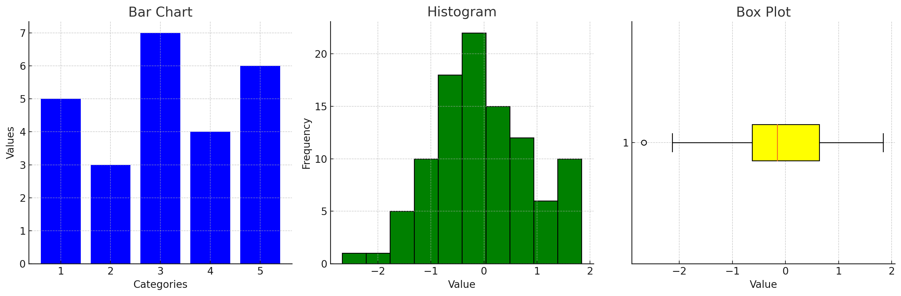

<!--
Author: Lorena
Course: DataCamp - Introduction to Statistics
Chapter: 1 - Summary Statistics
-->

# 📊 Summary Statistics – Chapter 1 Notes

In this chapter, you'll learn how to describe your data using summary statistics such as **mean**, **median**, and **standard deviation**.  
You'll also develop critical thinking skills to interpret these measures and choose the most appropriate ones for your dataset.

## 📚 Table of Contents

1. [🔍 What is Statistics?](#🔍-what-is-statistics)
2. [📈 Why Statistics Matter](#📈-why-statistics-matter)
3. [⚠️ Limitations of Statistics](#⚠️-limitations-of-statistics)
4. [🔢 Types of Data](#🔢-types-of-data)
5. [📊 Data Visualization](#📊-data-visualization)
6. [📍 Measures of Center](#📍-measures-of-center)
    - [🧠 When to Use the Mean](#🧠-when-to-use-the-mean)
    - [🤔 When to Use the Median](#🤔-when-to-use-the-median)
    - [😎 When to Use the Mode](#😎-when-to-use-the-mode)
    - [🧪 TL;DR Quick Guide](#🧪-tldr-quick-guide)
7. [🌊 Measures of Spread](#🌊-measures-of-spread)
8. [📦 Box Plots](#📦-box-plots)

## 🔍 What is Statistics?

**Statistics** is the science of:
- Collecting
- Analyzing
- Interpreting
- Presenting data

Two main branches:
- **Descriptive statistics**: Describe and summarize data (e.g., average crime rate).
- **Inferential statistics**: Draw conclusions about a population based on a sample.

## 📈 Why Statistics Matter

Statistics is everywhere—sports, medicine, marketing, government, and science.  
It helps answer real-world questions like:
- What’s the average salary in a region?
- Do ads actually boost sales?
- Is this new vaccine effective?

## ⚠️ Limitations of Statistics

- Only addresses **measurable**, **well-defined** questions.
- Doesn’t tell you **why** something happens—just **what** and **how often**.

## 🔢 Types of Data

### **Numerical Data**
- **Continuous**: Can take any value in a range (e.g., temperature, stock prices).
- **Count**: Whole numbers only (e.g., cups of coffee per day).

### **Categorical Data**
- **Nominal**: No natural order (e.g., eye color, country).
- **Ordinal**: Ordered categories (e.g., survey ratings: satisfied, neutral, dissatisfied).

## 📊 Data Visualization

Use graphs to explore and communicate:

- **Bar charts**: Compare categories or groups. Ideal for visualizing counts or proportions.  
    📌 *Example*: Number of students in each grade level.

- **Histograms**: Show the distribution of numerical data. Useful for identifying patterns like skewness or modality.  
    📌 *Example*: Distribution of test scores in a class.

- **Box plots**: Summarize data using medians, quartiles, and potential outliers. Great for comparing multiple datasets.  
    📌 *Example*: Comparing salaries across different industries.

## 📍 Measures of Center

These show the "typical" value in a dataset:
- **Mean**: Arithmetic average.
- **Median**: Middle value when sorted.
- **Mode**: Most frequently occurring value.

### 🧠 When to Use the Mean

Use the **mean** when:
- Data is **symmetrical** (bell-shaped or normal).
- You **care about every value** (like total budget or average grade).
- There are **no major outliers**.

📌 *Example*: Test scores in a class where everyone performed similarly.

### 🤔 When to Use the Median

Use the **median** when:
- Data is **skewed** (lopsided or has outliers).
- You want a "typical" value not distorted by extremes.
- You're working with **income, home prices, or crime stats**.

📌 *Example*: Median income in a city with both billionaires and broke college students.

### 😎 When to Use the Mode

Use the **mode** when:
- Data is **categorical** (e.g., colors, brands, types).
- You want the **most common** value.
- Data has multiple peaks (**bimodal or multimodal** distributions).

📌 *Example*: Most popular pizza topping in a survey.

### 🧪 TL;DR Quick Guide

| Scenario                      | Best Measure |
|------------------------------|--------------|
| Symmetric data, no outliers  | Mean         |
| Skewed data or outliers      | Median       |
| Categorical / most frequent  | Mode         |

> ⚠️ If your dataset is a hot mess, the **median** is the hero you didn’t know you needed.

## 🌊 Measures of Spread

These tell you **how varied** your data is:

- **Range** = Max − Min  
- **Variance** = Average squared distance from the mean  
- **Standard Deviation** = Square root of the variance  
- **Quartiles & IQR**:
  - Split data into four equal parts
  - **IQR (Interquartile Range)** = Q3 − Q1  
  ✅ Great for spotting and ignoring outliers

## 📦 Box Plots

Box plots show:
- Median
- Quartiles (Q1 and Q3)
- Potential outliers

Ideal for comparing distributions at a glance.